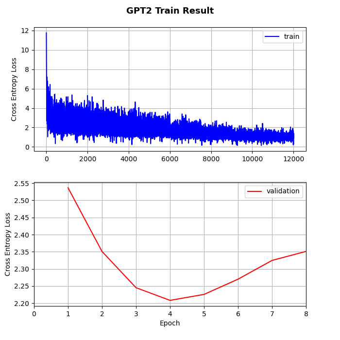

### 이 저장소(Repository)는 「Pytorch 기반 GPT 모델 및 모듈 라이브러리」에 대한 내용을 다루고 있습니다.

***
작성자: YAGI<br>

최종 수정일: 2025-03-28
+ 2025.03.27: 코드 작성 완료
+ 2025.03.28: READ ME 작성 완료
+ 2025.03.28: 프로젝트 종료
+ 2025.03.30: 오류 수정, 모듈 추가 및 삭제
    * `Grouped Query Attention` 모듈의 `RoPE` 미적용 사항 수정
    * `RoPEAttenion` 모듈 추가
    * `RoPETransformerBlock` 모듈 추가
    * `AddNorm` 모듈 삭제
***

<br>

***
+ 프로젝트 기간: 2025-03-22 ~ 2025-03-28
***
<br>

## 프로젝트 내용
&nbsp;&nbsp; 본 프로젝트에서는 Pytorch 기반의 다양한 GPT 모델과 `RoPE(Rotary PositionalEmbedding)`, `MoE(Mixture of Expert)`와 같은 GPT 모델에 사용되는 여러 모듈을 제공한다. 나아가 Hugging Face에서 제공하는 `databricks/databricks-dolly-15k` 데이터셋을 이용하여 몇 가지 모델의 평가 지표를 제시한다. Table 1은 `gptModules` 라이브러리에서 제공하는 GPT 모델에 대한 설명이다.

<br>

|Model|Description|Code|
|:---:|:---|:---:|
|GPT-1|-|`models.GPT(...)`|
|GPT-2|*· Pre-Norm Layer*|`models.GPT2(...)`|
|ALiBi GPT|*· Pre-Norm Layer <br> · ALiBi Embedding Layer*|`models.ALiBiGPT(...)`|
|LLaMA|*· Pre-Norm Layer <br> · RoPE Embedding Layer <br> · Group Query Attention <br> · RMS Normalization*|`models.LLaMA(...)`|
|DeepSeek V2|*· Pre-Norm Layer <br> · RoPE Embedding Layer <br> · Multi Head Latent Attention <br> · DeepSeek MoE <br> · RMS Normalization*|`models.DeepSeek(...)`|

<br> 

<b>Table 1</b>. gptModules Library Models.

<br>

&nbsp;&nbsp; `gptModules` 라이브러리의 `layers`를 사용하여 모델뿐만 아니라 GPT에 사용되는 다양한 모듈에 접근할 수 있다. Table 2는 본 라이브러리에서 제공하는 GPT 모듈에 대한 설명이다.

<br>

<table class="tg" style="undefined;table-layout: fixed; width: 667px"><colgroup>
<col style="width: 114.090909px">
<col style="width: 275.181818px">
<col style="width: 278.181818px">
</colgroup>
<thead>
  <tr>
    <th class="tg-hj9z">Layer</th>
    <th class="tg-c7c9">Module</th>
    <th class="tg-ejl1">Code</th>
  </tr></thead>
<tbody>
  <tr>
    <td class="tg-ue70" rowspan="4">Embedding</td>
    <td class="tg-hquy">· Embedding</td>
    <td class="tg-mg0j">layers.Embeddings(...)</td>
  </tr>
  <tr>
    <td class="tg-it0k">· Embedding Without Positional Embedding</td>
    <td class="tg-0ocd">layers.EmbeddingsWithoutPosition(...)</td>
  </tr>
  <tr>
    <td class="tg-hquy">· Rotary Positional Embedding</td>
    <td class="tg-mg0j">layers.RotaryPositionalEmbeddings(...)</td>
  </tr>
  <tr>
    <td class="tg-it0k">· ALiBi(Attention with Linear Biases) Positional Embedding</td>
    <td class="tg-0ocd">layers.ALiBiEmbeddings(...)</td>
  </tr>
  <tr>
    <td class="tg-ue70">Normalization</td>
    <td class="tg-hquy">· RMS Normalization</td>
    <td class="tg-mg0j">layers.RMSNorm(...)</td>
  </tr>
  <tr>
    <td class="tg-dxyq" rowspan="6">Multi Head Attention</td>
    <td class="tg-it0k">· Masked Multi Head Attention</td>
    <td class="tg-0ocd">layers.MaskedMultiHeadAttention(...)</td>
  </tr>
  <tr>
    <td class="tg-hquy">· ALiBi Attention</td>
    <td class="tg-mg0j">layers.ALiBiAttention(...)</td>
  </tr>
  <tr>
    <td class="tg-hquy">· RoPE Attention</td>
    <td class="tg-mg0j">layers.RoPEAttention(...)</td>
  </tr>
  <tr>
    <td class="tg-it0k">· GQA(Grouped Query Attention) **with RoPE</td>
    <td class="tg-0ocd">layers.GroupedQueryAttention(...)</td>
  </tr>
  <tr>
    <td class="tg-hquy">· GQA Without RoPE</td>
    <td class="tg-mg0j">layers.GroupedQueryAttentionWithoutRoPE(...)</td>
  </tr>
  <tr>
    <td class="tg-it0k">· Multi Head Latent Attention **with RoPE</td>
    <td class="tg-0ocd">layers.MultiHeadLatentAttention(...)</td>
  </tr>
  <tr>
    <td class="tg-hquy">· Multi Head Latent Attention Without RoPE</td>
    <td class="tg-mg0j">layers.MultiHeadLatentAttentionWithoutRoPE(...)</td>
  </tr>
  <tr>
    <td class="tg-dxyq" rowspan="2">Feed Forward</td>
    <td class="tg-it0k">· Position Wise Feed Forward</td>
    <td class="tg-0ocd">layers.PositionWiseFeedForward(...)</td>
  </tr>
  <tr>
    <td class="tg-hquy">· Deep Seek V2 Mixture of Expert(MoE)</td>
    <td class="tg-mg0j">layers.DeepSeekMoE(...)</td>
  </tr>
  <tr>
    <td class="tg-dxyq" rowspan="6">Transfomer Block</td>
    <td class="tg-it0k">· Transformer Block</td>
    <td class="tg-0ocd">layers.TransformerBlock(...)</td>
  </tr>
  <tr>
    <td class="tg-hquy">· Pre-Norm Transformer Block</td>
    <td class="tg-mg0j">layers.PreNormTransformerBlock(...)</td>
  </tr>
  <tr>
    <td class="tg-it0k">· ALiBi Transformer Block</td>
    <td class="tg-0ocd">layers.ALiBiTransformerBlock(...)</td>
  </tr>
  <tr>
    <td class="tg-it0k">· RoPE Transformer Block</td>
    <td class="tg-0ocd">layers.RoPETransformerBlock(...)</td>
  </tr>
  <tr>
    <td class="tg-hquy">· Grouped Query Transformer Block</td>
    <td class="tg-mg0j">layers.GroupedQueryTransformerBlock(...)</td>
  </tr>
  <tr>
    <td class="tg-i3ef">· Deep Seek Transformer Block</td>
    <td class="tg-1l0q">layers.DeepseekTransformerBlock(...)</td>
  </tr>
  <tr>
    <td class="tg-cjj3">· Deep Seek Transformer Block Without RoPE</td>
    <td class="tg-96f4">layers.DeepSeekTransformerBlockWithoutRoPE(...)</td>
  </tr>
</tbody></table>


<b>Table 2</b>. gptModules Library Layers.

<br>


<br>

&nbsp;&nbsp; Hugging Face에서 제공하는 `databricks/databricks-dolly-15k` 데이터셋을 이용하여 `gputModules`의 각 모델을 학습하였다. Tokenizer는 `GPT2Tokenizer`를 사용하였다. `n_layer=9`, `n_heads=10`, `d_model=560`, `d_ff=2304`를 모든 모델의 기본적인 아키텍처 하이퍼파라미터로 설정하였다. 별개의 하이퍼파라미터를 요구하는 모델인 `LLaMA`의 경우 `n_groups=5`, `rope_base=500_000`으로 설정하였으며, `DeepSeek`의 경우 `n_shared=1`, `d_ff=576`, `top_k=2`, `d_kv_comp=12`, `d_rope=14`, `rope_base=10_000`으로 설정하였다. 옵티마이저로 `AdamW`를 사용하였다. learning rate의 경우 초기 0에서 최대 0.00022까지 상승하여 이후 점차 감소하도록 learning rate decay를 수행하였다. 총 Epoch은 8회이며 Batch 사이즈는 8이다. Fig 1은 Train set과 Validation set에 대한 각 모델의 학습에 따른 Loss의 변화를 제시한 것으로, 최종 Test set에 대한 Loss 및 학습 수행 과정 간의 Iter / Sec를 Table 3을 통해 확인할 수 있다.

<br>
<br>
<br>

<b>Fig 1</b>. Loss Graph of Models about Train and Validation Dataset.

<br><br><br>

|Model|Test Loss|Iter/Sec|
|:---:|:---|:---:|
|GPT-1|2.402|<span style="color:red">**8.262**</span>|
|GPT-2|3.210|7.235|
|ALiBi GPT|<span style="color:red">**1.702**</span>|7.132|
|LLaMA|2.681|4.523|
|DeepSeek V2|2.189|2.688|

<b>Table 3</b>. Loss and *Iter/sec* of Test Dataset.


<br><br>

## Getting Start

### Example
```python
#TRAIN and Save Model
$ python train.py --model GPT --device cuda #choice model [GPT, GPT2, ALiBiGPT, LLaMA, DeepSeek,]

'''
`학습 완료 후, ./figures/`에 학습 그래프가 저장됨.
`./saved_models`에 학습된 모델이 저장됨.
'''


#Inference Example
$ python inference.py --prompt 'Where is Florida' --model DeepSeek --device cuda #you can edit prompt


>>> 
============< DeepSeek Inference>===========
'user: Where is Florida'
'user: Where is Florida ai: Florida is a state located in the United States of America.'
============================================
```
<br>

### Use Models or Modules
```python
import torch
from gptModules import models, layers


VOCAB_SIZE = 256
DEVICE = 'cuda:0'

x = torch.randint(0, VOCAB_SIZE, size=(1, 5)).to(DEVICE) #Input Tensor: Batch(1) x Seq(5)
att_mask = torch.ones(1, 5, dtype=torch.int).to(DEVICE)

#x = tensor([[ 43, 224,  12, 199, 212]])
#att_mask = tensor([[1, 1, 1, 1, 1]])


model = models.GPT(
    vocab_size=VOCAB_SIZE,
    n_layers=2,
    n_heads=4,
    d_model=64,
    d_ff=1024,
    max_seq_length=64,
).to(DEVICE)


out = model(x, att_mask) #Softmax 적용 안됨
```
***

<br><br>

## 개발 환경
**Language**

    + Python 3.9.1

    
**Library**

    + tqdm 4.67.1
    + pytorch 2.1.2+cu118
    + transformers 4.49.0

<br><br>

## License
This project is licensed under the terms of the [MIT license](https://github.com/YAGI0423/gpt_modules/blob/main/LICENSE).